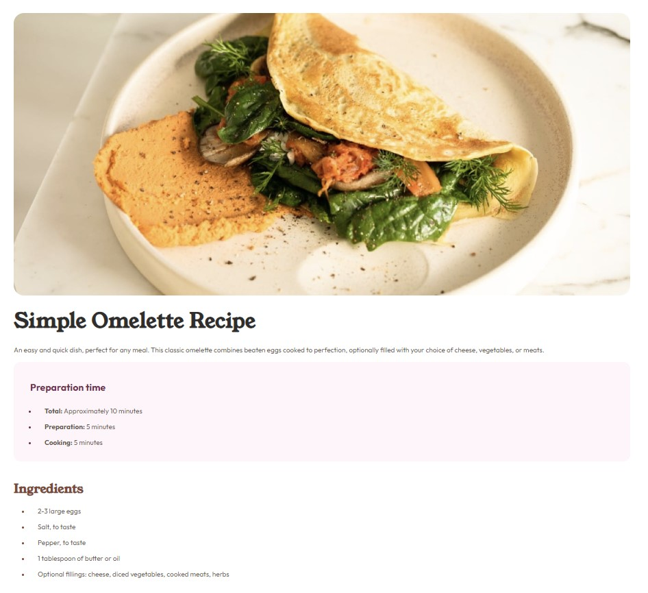
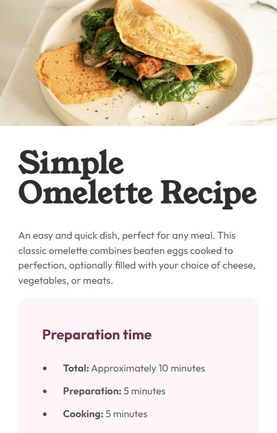

# Frontend Mentor - Recipe page solution

This is a solution to the [Recipe page challenge on Frontend Mentor](https://www.frontendmentor.io/challenges/recipe-page-KiTsR8QQKm).

## Table of contents

- [Overview](#overview)
  - [The challenge](#the-challenge)
  - [Screenshot](#screenshot)
  - [Links](#links)
- [My process](#my-process)
  - [Built with](#built-with)
  - [What I learned](#what-i-learned)
  - [Useful resources](#useful-resources)
- [Author](#author)

## Overview

### Screenshot

- Desktop: 
- Mobile: 

### Links

- Solution URL: [GitHub](https://github.com/Prithwish-Hati/recipe-page)
- Live Site URL: [Vercel](https://recipe-page-ph.vercel.app/)

## My process

### Built with

- Semantic HTML5 markup
- CSS custom properties
- Flexbox
- Mobile-first workflow

### What I learned

1. I learned about the `text-indent` property, which is used to specify the indentation of the first line in a text block.
2. I gained knowledge about media queries and their application for responsive design. In this project, a media query is utilized to adjust styles based on the screen width.
3. I discovered the use of the ::marker pseudo-element to style the marker of list items. In this case, the color of the marker is customized for better visual presentation.

### Useful resources

- [MDN Reference](https://developer.mozilla.org/en-US/docs/Web/css/reference) - This helped me in understanding `text-indent` property and `::marker` pseudo-element.

## Author

- Website - [Prithwish Hati](https://prithwish.vercel.app/)
- Frontend Mentor - [@Prithwish-Hati](https://www.frontendmentor.io/profile/Prithwish-Hati)
- Twitter - [@PrithwishHati](https://twitter.com/PrithwishHati)
